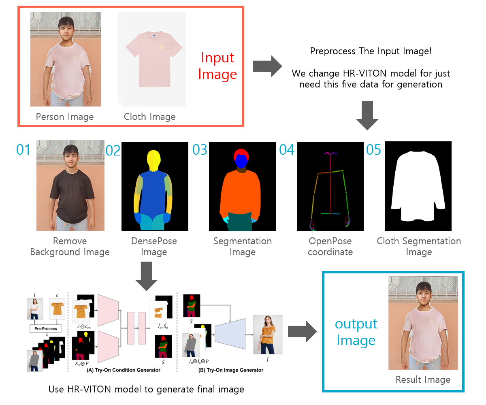

# VISIONPROJECT - A 3D TRY ON CLOTHES APPLICATION.

> [Notre presentation](./VISIONPROJECT.pptx)

## Colab Demo
You can simply try it using colab

## Installation
~~see [INSTALL.md](./INSTALL.md) for the installation~~
we will add INSTALL.md soon.

## References
#### HR-VITON
https://github.com/sangyun884/HR-VITON
#### Posenet
https://github.com/rwightman/posenet-python
#### Graphonomy
https://github.com/Gaoyiminggithub/Graphonomy
#### detectron2
https://github.com/facebookresearch/detectron2
#### cloth image segmentation
https://github.com/ternaus/cloths_segmentation
